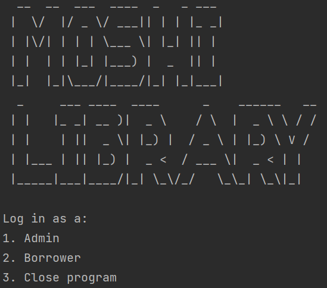
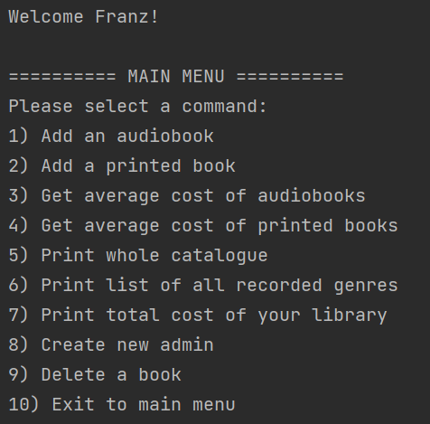
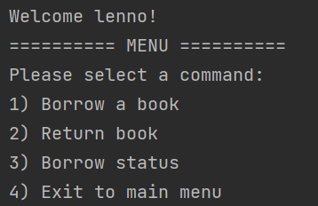

# MOSHI Library System

Team Member:

Lenno Aubert Hartono - 2602116983

Gde Ngurah Randy Agastya - 2602119165

Francesco Emmanuel Setiawan - 2602209620

In this repository, we made a library system using Java Programming Language. This program aims to compare and contrast the performance of each data structure that we used to make the program.

We used 5 data structures:

1. ArrayList
2. LinkedList
3. HashMap
4. HashSet
5. TreeSet

### How to run?

1. [Click here](https://github.com/aubertlenno/MOSHI-Library-System/archive/refs/heads/main.zip) to download the resources
2. Unzip the folder
3. Open the unzipped folder
4. Right click on any data structure folder
5. Open the folder with any IDE you used (preferably Jetbrains Intellij)
6. Run the program

### Screenshots

